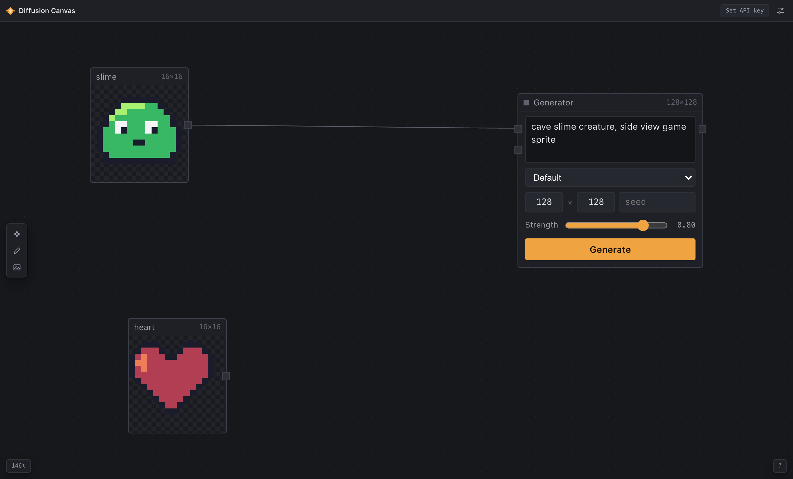

# Diffusion Canvas

[](https://github.com/andrewrexo/diffusion-canvas/actions/workflows/ci.yml)

An infinite canvas for making pixel art with [Retro Diffusion](https://retrodiffusion.ai).



Drop in reference images, wire them into generator nodes, and iterate on the results with a
built-in pixel editor — img2img, palette constraints, and hand editing in one place instead of
bouncing between a prompt box and an image editor.

## How it works

- **Generators are nodes.** Each generator card holds a prompt, a Retro Diffusion style
  (Plus / Fast / Pro families), output size, and an optional seed. Results land on the canvas
  as image nodes, linked back to the generator that produced them.
- **Images feed generators.** Drag from an image's output port into a generator's `src` port
  for img2img with an adjustable strength, or into `pal` to constrain the output to that
  image's colors. Reconnect or unplug edges by dragging them off a port.
- **Everything is editable.** Double-click any image to open the pixel editor: pencil, eraser,
  flood fill, line, rectangle, and eyedropper, with brush sizes, the image's extracted color
  palette, Sweetie 16, and per-session undo. Save writes back to the node, so a touched-up
  sprite can go straight back into another generation.
- **Animation is built in.** Animation styles return spritesheets that land as multi-frame
  nodes and play live on the canvas. The editor grows a frame timeline with onion skinning and
  playback, so generated animations can be retimed and touched up frame by frame — and any
  drawing can become an animation.
- Projects autosave to the browser. Stills export as PNG at 1×/4×/8×; animations export as
  looping GIFs (via a dependency-free GIF89a encoder in `src/lib/gif.ts`) or spritesheet strips.

## Running it

You'll need [Bun](https://bun.sh) (Node + npm works too) and a Retro Diffusion API key.

```sh
bun install
bun run dev
```

Open the app and add your key in settings (top right). The key stays in localStorage, and API
calls go through Vite's dev-server proxy, so there are no CORS issues and no backend to run.

Press `?` in the app for keyboard shortcuts — most of the canvas is driveable without the
mouse leaving the node you're working on.

## Testing

`bun run test` covers the pure parts with Vitest: the drawing algorithms (Bresenham lines,
flood fill, brushes), palette extraction, the GIF encoder (structural checks plus an LZW
round-trip against a reference decoder), and the store's undo history and graph edge rules.

`bun run e2e` drives the real UI with Playwright — drawing in the editor, wiring ports, and a
full generation round-trip against a mocked API, so no key or network is needed. CI runs lint,
both suites, and the production build on every push.

## Deploying

The repo is set up for [Cloudflare Pages](https://pages.cloudflare.com): the static build plus a
small Pages Function (`functions/api/rd/[[path]].ts`) that proxies API calls to Retro Diffusion,
mirroring what the Vite dev proxy does locally. API keys pass through per-request and are never
stored server-side.

```sh
bun run deploy
```

The first run will prompt `wrangler` to log in and create the project. You can also connect the
repo in the Cloudflare dashboard to deploy on every push.

## Stack

React 19, TypeScript, Zustand, and Vite. The canvas, node graph, and pixel editor are
hand-rolled on DOM transforms and a single `<canvas>` — no diagramming or drawing libraries.

## License

MIT
